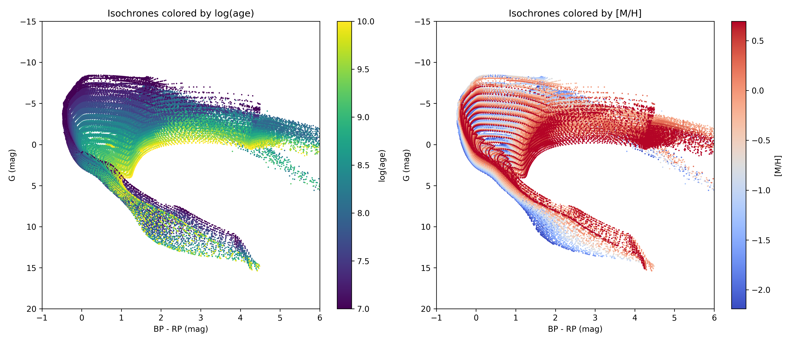
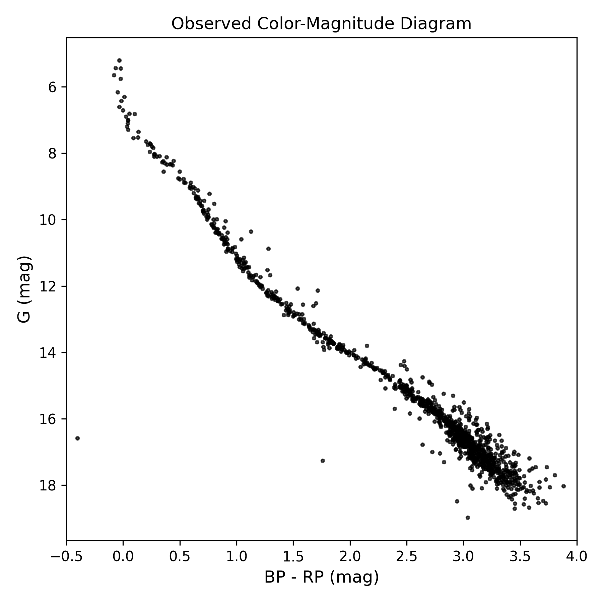
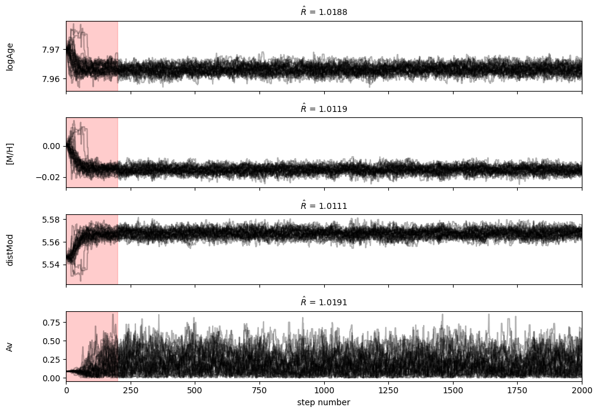
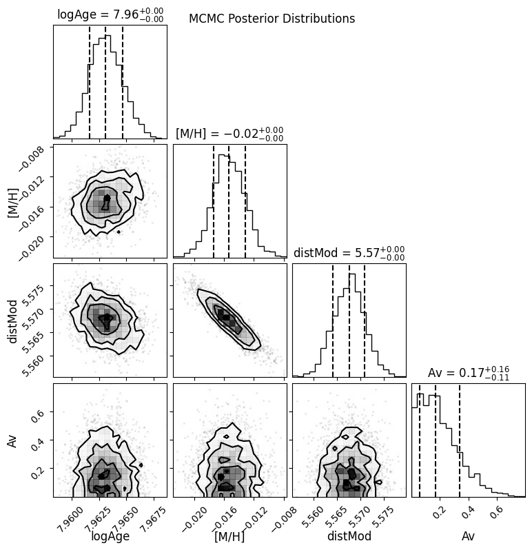

Quick Start
===========

The ELISA workflow follows five steps:

1. Download or load an isochrone grid
2. Load observed photometry
3. Configure priors and build the posterior
4. Run MCMC
5. Analyze results

Step 1: Download an Isochrone Grid
----------------------------------

.. code-block:: python

   from elisa import ElisaClusterInference

   elisa_inference = ElisaClusterInference()

   iso_grid = elisa_inference.download_isochrones(
       logage_range=(7.0, 10.0, 0.2),
       MH_range=(-2.5, 1.0, 0.25),
       photsys='gaiaEDR3',
       output_dir='isochrone_data',
       output_name='parsec_gaia_grid',
       save_file=True,
   )

.. code-block:: text

    Grid size: 16 ages x 15 metallicities = 240 isochrones
    Downloading from PARSEC server (this may take a few minutes)...
    Querying http://stev.oapd.inaf.it/cgi-bin/cmd...
    Retrieving data...
    Downloading data...http://stev.oapd.inaf.it/tmp/output727813235092.dat
    Download complete!
    Shape: (88247, 31)

    Grid summary:
      Total rows: 88,247
      Unique log(age) values: 16
      Unique [M/H] values: 13
      Mass range: 0.090 - 20.85 M_sun

    Saved to: ../isochrone_data/parsec_gaia_test.parquet (2.1 MB)
    Saved to: ../isochrone_data/parsec_gaia_test_metadata.txt

To reload a previously saved grid:

.. code-block:: python

   iso_grid = elisa_inference.load_isochrone_grid(
       'isochrone_data/parsec_gaia_grid.parquet'
   )

**Visualize the Isochrone Grid**

.. code-block:: python

    import matplotlib.pyplot as plt

    fig, axes = plt.subplots(1, 2, figsize=(14, 6))

    scatter1 = axes[0].scatter(iso_grid['G_BPmag'] - iso_grid['G_RPmag'], iso_grid['Gmag'], c=iso_grid['logAge'], cmap='viridis', s=0.5)
    axes[0].set_xlabel('BP - RP (mag)')
    axes[0].set_ylabel('G (mag)')
    axes[0].set_title('Isochrones colored by log(age)')
    axes[0].invert_yaxis()
    axes[0].set_xlim(-1, 6)
    axes[0].set_ylim(20, -15)
    plt.colorbar(scatter1, ax=axes[0], label='log(age)')

    scatter2 = axes[1].scatter(iso_grid['G_BPmag'] - iso_grid['G_RPmag'], iso_grid['Gmag'], c=iso_grid['MH'], cmap='coolwarm', s=0.5)
    axes[1].set_xlabel('BP - RP (mag)')
    axes[1].set_ylabel('G (mag)')
    axes[1].set_title('Isochrones colored by [M/H]')
    axes[1].invert_yaxis()
    axes[1].set_xlim(-1, 6)
    axes[1].set_ylim(20, -15)
    plt.colorbar(scatter2, ax=axes[1], label='[M/H]')

    plt.tight_layout()
    plt.show()

   The downloaded isochrone grid showing the age-metallicity distribution.

Step 2: Load Observed Data
--------------------------

ELISA provides :class:`~elisa.query.data.ElisaQuery` to fetch photometry from
Gaia and load cluster membership catalogs from VizieR.

Available catalogs: `alfonso-2024 <https://ui.adsabs.harvard.edu/abs/2024A%26A...689A..18A/abstract>`_, `cantat-gaudin-2020 <https://ui.adsabs.harvard.edu/abs/2020A%26A...640A...1C/abstract>`_, `hunt-2023 <https://ui.adsabs.harvard.edu/abs/2023A%26A...673A.114H/abstract>`_, `vasiliev-2021 <https://ui.adsabs.harvard.edu/abs/2021MNRAS.505.5978V/abstract>`_.

.. code-block:: python

   from elisa.query.data import ElisaQuery

   elisa_query = ElisaQuery()

   df_clusters, df_members = elisa_query.load_catalog(
       'alfonso-2024', load_members=True
   )
   # Filter members of the Melotte 22 cluster and get their Gaia DR3 source IDs
   source_ids = df_members[
       df_members['Cluster'] == 'Melotte_22'
   ]['GaiaDR3'].values

   df = elisa_query.gaia_source_id(source_id=source_ids)

**Output:**

.. code-block:: text

    Warning: the passwords of all user accounts have been inactivated. 
    Please visit https://cas.cosmos.esa.int/cas/passwd to set a new one. Workaround solutions for the Gaia Archive issues following the infrastructure upgrade: https://www.cosmos.esa.int/web/gaia/news#WorkaroundArchive
    Using VizieR server: https://vizier.cfa.harvard.edu
    Loading clusters and members from Alfonso et al. 2024
    Loaded 370 clusters from the alfonso-2024 catalog.
    Loaded 87708 members from the alfonso-2024 catalog.

    INFO: Query finished. [astroquery.utils.tap.core]
    Query returned 1130 rows.

Prepare the observed magnitudes and errors as NumPy arrays with shape
``(n_stars, 3)`` for the bands ``[G, BP, RP]``:

.. code-block:: python

   import numpy as np

   df.rename(columns={
       'phot_g_mean_mag': 'Gmag',
       'phot_bp_mean_mag': 'BPmag',
       'phot_rp_mean_mag': 'RPmag',
   }, inplace=True)

   observed_mags = df[['Gmag', 'BPmag', 'RPmag']].values
   observed_errors = np.column_stack([
       df['parallax_error'].values,
       df['parallax_error'].values,
       df['parallax_error'].values,
   ])

   fig, ax = plt.subplots(figsize=(6, 6))
   bp_rp = observed_mags[:, 1] - observed_mags[:, 2]
   scatter = ax.scatter(bp_rp, observed_mags[:, 0], c='k', s=5, alpha=0.7)
   ax.set_xlabel('BP - RP (mag)', fontsize=12)
   ax.set_ylabel('G (mag)', fontsize=12)
   ax.invert_yaxis()
   ax.set_title('Observed Color-Magnitude Diagram')
   ax.set_xlim(-0.5, 4.0)

   plt.tight_layout()
   plt.show()

   The downloaded Pleiades Color-Magnitude Diagram (CMD) showing the observed photometry of cluster members.

Step 3: Set Up the Posterior
----------------------------

Define initial parameter guesses and priors. ELISA supports two prior types:

- ``'uniform'`` with ``(low, high)``
- ``'gaussian'`` with ``(mean, std)``

.. code-block:: python

   init_logAge = 8.1
   init_MH = 0.0
   distance_pc = 136.0
   init_dm = 5 * np.log10(distance_pc / 10)
   init_AV = 0.1

   posterior = elisa_inference.setup_logposterior(
       grid=iso_grid,
       observed_mags=observed_mags,
       observed_errors=observed_errors,
       prior_logAge=(6.0, 10.5),
       prior_MH=(init_MH, 0.3),
       prior_dm=(init_dm, 1.0),
       prior_AV=(init_AV, 0.2),
       prior_type={
           'logAge': 'uniform',
           'MH': 'gaussian',
           'dm': 'gaussian',
           'AV': 'gaussian',
       },
       correct_extinction = False
   )

   init_params = posterior.get_initial_params(
       logAge_init=init_logAge,
       MH_init=init_MH,
       dm_init=init_dm,
       AV_init=init_AV,
   )

.. code-block:: text

    Building lookup structure...
    Grid loaded!
    Age range: [7.00, 10.00]
    [M/H] range: [-2.19, 0.70]
    Mass range: [0.090, 20.85] M_sun

**Refine initial parameters:**

.. code-block:: python
    
    from scipy.optimize import minimize

    results_mle = minimize(lambda params: -posterior(params), init_params, method='Nelder-Mead', 
                            options={'maxiter': 10000, 'xatol': 1e-4, 'fatol': 1e-4})
    init_params_mle = results_mle.x

    for key, value in zip(['logAge', 'MH', 'dm', 'AV'], init_params_mle):
        v = str(value) if not 'logAge' in key else str(value) + " -> " + str(round(10**value / 10**6, 1)) + " Myr"
        print(f"{key}: {v}")

.. code-block:: text

    logAge: 7.96991070305036 -> 93.3 Myr
    MH: 0.0006115302938599243
    dm: 5.546796129708861
    AV: 0.09032053836204017

Step 4: Run MCMC
----------------

.. code-block:: python

   sampler = elisa_inference.run_mcmc(
       log_posterior=posterior,
       init_params=init_params_mle,
       n_walkers=32,
       n_steps=2000,
       progress=True,
   )

.. code-block:: text

    MCMC Setup:
    Parameters: 4 (logAge, MH, dm, AV)
    Walkers: 32
    Steps: 2000
    Checking initial positions...
    Valid initial positions: 32/32
    Running MCMC...
    100%|██████████| 2000/2000 [07:16<00:00,  4.58it/s]

``run_mcmc`` also supports parallel execution with ``parallel=True`` and
``n_cores=4``.

Step 5: Analyze Results
-----------------------

**Convergence diagnostics:**

.. code-block:: python

    n_burn = 200
    flat_samples = sampler.get_chain(discard=n_burn, flat=True)

    # Gelman-Rubin needs individual chains: (n_walkers, n_steps, n_params)
    chains = sampler.get_chain(discard=n_burn).transpose(1, 0, 2)
    R_hat = elisa_inference.get_gelman_rubin(chains)

    fig, axes = plt.subplots(4, figsize=(10, 7), sharex=True)
    samples = sampler.get_chain()
    labels = ["logAge", "[M/H]", "distMod", "Av"]
    for i in range(4):
        ax = axes[i]
        ax.plot(samples[:, :, i], "k", alpha=0.3)
        ax.set_xlim(0, len(samples))
        ax.set_ylabel(labels[i])
        ax.yaxis.set_label_coords(-0.1, 0.5)
        ax.axvspan(0, n_burn, alpha=0.2, color='red', label='Burn-in')
        ax.set_title(f"$\\hat{{R}}$ = {R_hat[i]:.4f}", fontsize=10, loc='center')

    axes[-1].set_xlabel("step number")
    plt.tight_layout()

   The chains for each parameter with burn-in shaded in red and the Gelman-Rubin statistic displayed in the title.

.. code-block:: python

    import corner

    fig = corner.corner(flat_samples, labels=labels, quantiles=[0.16, 0.5, 0.84], show_titles=True, 
                        title_kwargs={"fontsize": 12}, label_kwargs={"fontsize": 12})
    fig.suptitle("MCMC Posterior Distributions", fontsize=12)
    fig.set_size_inches(8, 8)

   Corner plot showing the posterior distributions and parameter correlations.

.. code-block:: python

   n_burn = 200
   chains = sampler.get_chain(discard=n_burn).transpose(1, 0, 2)
   R_hat = elisa_inference.get_gelman_rubin(chains)

**Autocorrelation and thinning:**

.. code-block:: python

   tau = sampler.get_autocorr_time(quiet=True)
   burnin = int(2 * np.max(tau))
   thin = int(0.5 * np.min(tau))
   flat_samples = sampler.get_chain(discard=burnin, thin=thin, flat=True)

**Results summary:**

.. code-block:: python

   results = elisa_inference.get_results_summary(flat_samples)

**Output:**

.. code-block:: text

    ============================================================
    CLUSTER PARAMETER RESULTS
    ============================================================
    logAge  : 7.9631 (+0.0015 / -0.0015)
    MH      : -0.0154 (+0.0022 / -0.0020)
    dm      : 5.5677 (+0.0032 / -0.0036)
    AV      : 0.1714 (+0.1647 / -0.1136)

    Derived quantities:
    Distance: 129.9 pc
    Age: 91.9 Myr
    ============================================================

**Corner plot:**

.. code-block:: python

   import corner

   labels = ["logAge", "[M/H]", "dm", "A_V"]
   corner.corner(
       flat_samples, labels=labels,
       quantiles=[0.16, 0.5, 0.84], show_titles=True,
   )

**Isochrone fit overlay:**

.. code-block:: python

   fig, ax = elisa_inference.plot_isochrone_fit(
       flat_samples=flat_samples,
       observed_mags=observed_mags,
       n_draws=200,
   )
